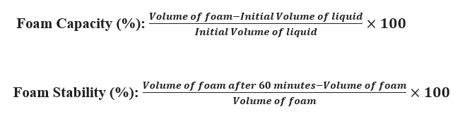

<b>Requirements (Instruments, Chemicals & Other) : </b>  

1.	Protein isolates powder   
2.	Beaker  
3.	Analytical Balance  
4.	Whipping machine  
5.	Measuring cylinder  
6.	Distilled water   

<b>Procedure : </b>  

1.	Weigh 0.5, 1, 1.5, 2 and 2.5 gm protein isolate powder in five different beakers and marked as S1, S2, S3, S4 and S5, respectively. 
2.	Pour 50 ml water in each beaker. 
3.	Whip the solutions for 2 minutes. 
4.	Transfer the dispersion of each beaker into the five different measuring cylinders and measure foam volume. 
5.	Measure foam volume of each sample after 60 min. 
6.	Record in observation table and calculate using following formulae: 

 

