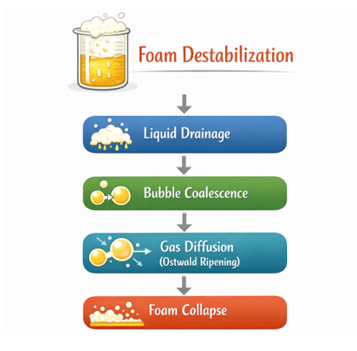
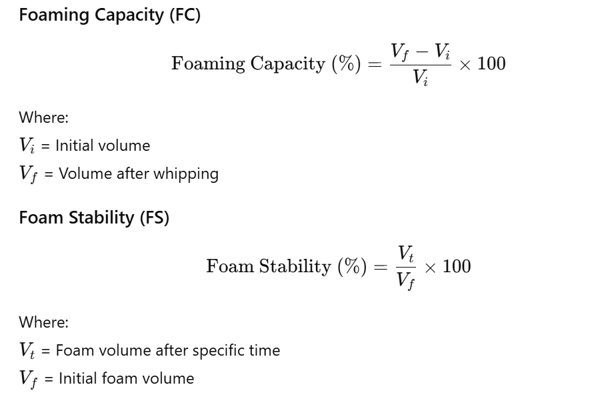

Foaming properties of proteins are important functional characteristics in many food products such as whipped creams, mousses, cakes, and aerated beverages. Foam is a colloidal system in which gas (air) is dispersed in a liquid phase and stabilized by surface-active agents like proteins. The ability of proteins to form and stabilize foams affects texture, volume, and sensory quality. 
When a protein solution is subjected to whipping or agitation, air is incorporated into the liquid. Proteins migrate to the newly created air–liquid interface, where they partially unfold. Their hydrophobic groups orient toward the air phase while hydrophilic groups remain in the aqueous phase, forming a viscoelastic interfacial film that stabilizes air bubbles and prevents coalescence. 
Foam stability refers to the ability of the foam to resist collapse over time. Destabilization occurs due to liquid drainage, bubble coalescence, and gas diffusion (Ostwald ripening). The strength, elasticity, and thickness of the protein film largely determine stability. The foam destabilization phenomena is depicted in the figure alongside. 
 
Measurement of Foaming Properties 
Foaming Capacity (FC) 
 
Higher protein concentration generally improves foam formation and stability due to greater interfacial coverage. However, excessively high concentrations may increase viscosity and hinder air incorporation.

<!--Foaming properties of proteins are critical functional characteristics in the food industry, playing an essential role in products such as whipped creams, mousses, cakes, and beverages. Proteins have the ability to stabilize air-liquid interfaces, which is a prerequisite for foam formation and stabilization. This experiment focuses on evaluating the foaming capacity and foam stability of protein isolates under controlled conditions. By understanding these properties, the suitability of protein isolates for various food formulations can be assessed, contributing to the development of improved food products. 
Foam is a colloidal system where air is dispersed in a liquid, typically stabilized by surfactants such as proteins. During whipping or agitation, air is incorporated into the liquid, and proteins migrate to the air-liquid interface, where they unfold and form a cohesive layer. This protein film prevents coalescence of air bubbles, leading to foam formation. The efficiency of foam formation is influenced by factors such as protein concentration, pH, and temperature. 
Foam stability refers to the ability of the foam to resist collapse over time. It depends on the thickness, elasticity, and strength of the protein film surrounding the air bubbles. Proteins with good surface-active properties, such as whey proteins, soy proteins, and egg whites, generally exhibit higher foam stability. Factors like drainage of liquid from the foam, coalescence of bubbles, and Ostwald ripening contribute to foam destabilization. 
Higher concentrations typically lead to better foam formation and stability because more protein is available to stabilize the air-liquid interface. However, excessive concentrations can sometimes hinder foam formation due to increased viscosity.
